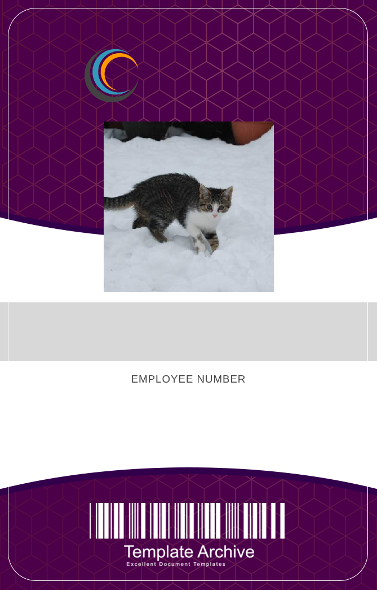

  # CatWorx-C-Sharp

  ## Description

  This C# console application allows users to create unique badges for each of their employees. Badges are output to the /data/dist folder. A faux company called Cat Worx is used as an example.

  ## Table of Contents

  - [Usage](#usage)
  - [Badge](#badge)
  - [Questions](#questions)

  ## Usage

  This is used to demonstrate C# and .NET principles, and may be used to create unique employee badges.

  ## Badge
  

  ## Questions

  - GitHub: [sora64](https://github.com/sora64/)

  - Email: If you have any other questions, please reach me at [phelpsa64@gmail.com](mailto:phelpsa64@gmail.com).

  